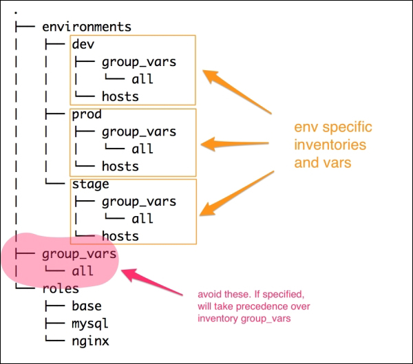

# Ansible #

This Repository contains Ansible playbook that can be used to install the application on Ubuntu machines.

JAVA, ActiveMQ, Tomcat, Mongodb, Apache, HAProxy, Redis, MySQL

### How to Install Ansible ###

http://docs.ansible.com/ansible/latest/installation_guide/intro_installation.html#latest-releases-via-apt-ubuntu

```sh
$ sudo apt-get update
$ sudo apt-get install software-properties-common
$ sudo apt-add-repository ppa:ansible/ansible
$ sudo apt-get update
$ sudo apt-get install ansible
```
### Arechitecture ###

Ansible arechitecture has been setup like below:



### How to run playbook ###

Below playbook will run for java on qa/hosts from site.yml

ansible-playbook site.yml -i qa/hosts --tags="java"

### Application installation method via these ansible

## Tomcat
Version: apache-tomcat-8.0.44

Tomcat is installed on /disk2/tomcat

tomcat run by user name 'tomcat' 

tomcat can be start/stop by init script

/etc/init.d/tomcat or service tomcat start/stop

home directory is /home/tomcat, it contains two important file that is being used while running the tomcat


### Important folder
/disk2/applogs  contains applog for scope

Log Config file for app: /home/tomcat/logback-stg.xml

Environment file: /home/tomcat/opsriver_services.properties

log file location: /disk2/tomcat/logs

context.xml-- mysql config

catalina.sh�heap size and other info

Conf file location: /disk2/tomcat/conf

/disk2/backup  --> contains backup of existing war files at deployment time

## Java
Version: java8

Java is installed via apt-get

## Apache
Version: apache2

Apache is installed via apt-get

Important folder
/etc/apache/site-enabled/

## HAProxy
Version: 1.5

HAPrody is installed via apt-get

Important folder
/etc/haproxy/hproxy.cfg

## Redis
Version: 4.0.2

Redis is installed via apt-get

Important folder
/etc/redis/redis.conf

Kernel Tuning:

vim /etc/sysctl.conf

redis hard nofile 65536
redis soft nofile 65536

net.core.somaxconn = 65535
vm.overcommit_memory = 1

Disable Transparent Huge Pages 

Disable Transparent Huge Pages (THP)

## ActiveMQ
Version: apache-activemq-5.14.0

ActiveMQ is installed on /disk2/activemq

MQ is installed on two machines for fail over

disk2/activemq-data is a shared folder on (MQ1) machine that is shared on (MQ2) as well via nfs, if activemq is stopped on first instance it will automatically start on second.

can be start/stop via below

/etc/init.d/activemq start/stop or sudo service activemq start/stop

Important folder
/disk2/activemq-data  is the folder that contains the data for MQ

/disk2/backup  --> contains backup of old and existing MQ versions and config files

## Kernel Tuning:

Active mq change : enableJournalDiskSyncs="false"
System change : sudo /sbin/sysctl -w net.core.netdev_max_backlog=3000 sudo /sbin/sysctl -w net.ipv4.tcp_fin_timeout=15 sudo /sbin/sysctl -w net.core.somaxconn=3000

## HazelCast
Version: hazelcast-3.5.2
hazel is installed on /disk2/hazelcast
hazel is installed on two machines for fail over

Important folder
/disk2/hazelcast/bin/hazelcast.xml  

## MySQL
Version: 5.6

We are using two server as Primary-Secondary, applciation writes only to Primary.

Important folder
/disk2/mysql  is the folder that contains the database

/disk2/scripts  --> script that takes backup of database nightly on S3

## MongoDB
Version: 3.4.10

MongoDB is deployed on cluster on Production, Stage and Performance env as well. We have created Replica set with two mongo and one Arbiter.

Important folder
/disk2/database  is the folder that contains the database

/disk2/logs folder for logs

/disk2/scripts  --> script that takes sanpshot twice in day on Azure Blob Storage

Kernel Tuning:

mongod hard nofile 65536
mongod soft nofile 65536

Disable Transparent Huge Pages